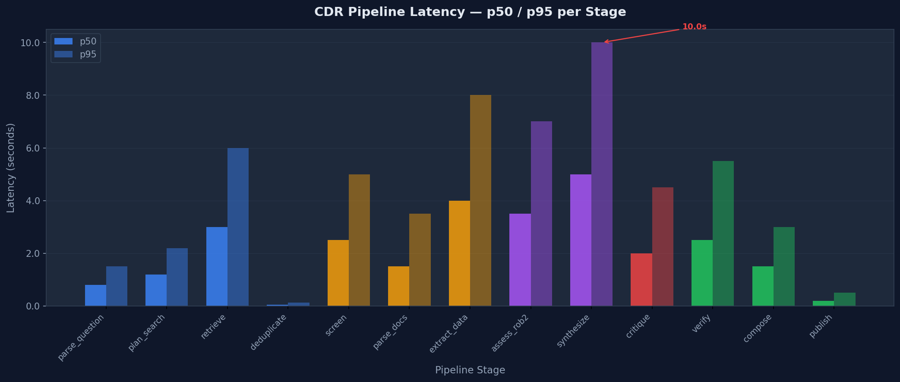

# CDR Evaluation

> How we measure output quality, and what the numbers mean.

## Overview

CDR's evaluation framework answers three questions:

1. **Structural completeness**: Does the pipeline produce all required artifacts?
2. **Evidence traceability**: Is every claim backed by verifiable snippets?
3. **Output quality**: How accurate and faithful are the claims?

## Evaluation Dataset

### Golden Set (5 questions)

The golden set contains 5 clinical questions with known evidence profiles:

| ID | Question | Evidence Level | Composition? |
|----|----------|---------------|-------------|
| GS-001 | Aspirin for secondary CV prevention | HIGH | No |
| GS-002 | Metformin + GLP-1 agonists vs monotherapy | MODERATE | Yes |
| GS-003 | Vitamin D for respiratory infections | LOW | No |
| GS-004 | High-sensitivity troponin for acute MI | MODERATE | No |
| GS-005 | Anti-inflammatory therapies for CV events + elevated CRP | MODERATE | Yes |

**Why these questions?** They cover a range of evidence levels (HIGH → LOW), include both established and emerging topics, and two questions (GS-002, GS-005) expect compositional inference (A+B⇒C).

**Toy set**: `eval/datasets/golden_set_toy.json` contains these 5 questions in machine-readable format.

**Checksum** (for reproducibility — computed over the `questions` array only, not the full file):

```
sha256:a55e120c9f5e79a97b8009435a1b255a813c0ee3ab6d2be66bf585e56cfbe426
```

Verify with:
```bash
python3 -c "
import json, hashlib
data = json.load(open('eval/datasets/golden_set_toy.json'))
print(hashlib.sha256(json.dumps(data['questions'], sort_keys=True, ensure_ascii=False).encode()).hexdigest())
"

### Custom Datasets

You can create custom evaluation datasets following the schema in `eval/datasets/golden_set_toy.json`. Each entry requires:

```json
{
  "id": "CUSTOM-001",
  "question": "Your clinical question",
  "population": "Target population",
  "intervention": "Intervention",
  "comparator": "Comparator (optional)",
  "outcome": "Primary outcome",
  "expected_evidence_level": "high|moderate|low|very_low",
  "expected_min_studies": 5,
  "composition_expected": false
}
```

## Metrics

### Core Metrics (DoD-level gating)

| Metric | Threshold | Description |
|--------|-----------|-------------|
| `snippet_coverage` | ≥ 1.00 | Every claim must have ≥1 supporting snippet |
| `verification_coverage` | ≥ 0.95 | 95%+ claims verified against source material |
| `claims_with_evidence_ratio` | ≤ 1.20 | Ratio of claims to evidence (detects fabrication) |
| `composition_emitted_rate` | ≥ 0.10 | ≥10% of runs produce A+B⇒C hypotheses |

### Quality Metrics (RAGAs-inspired)

| Metric | Description |
|--------|-------------|
| `context_precision` | Proportion of retrieved context that's relevant |
| `answer_faithfulness` | Degree to which claims are grounded in snippets |
| `citation_accuracy` | Correctness of PMID/NCT references |

### Run-Level KPIs

| KPI | Description |
|-----|-------------|
| `study_count` | Studies included after screening |
| `claim_count` | Evidence claims generated |
| `snippet_count` | Supporting snippets extracted |
| `prisma_counts` | Full PRISMA flow (identified → included) |
| `pipeline_status` | `completed` / `unpublishable` / `insufficient_evidence` |

## Running Evaluation

### Quick run (offline — structural checks, no API keys)

```bash
make eval
```

### Full pipeline evaluation (online — requires .env with LLM provider)

```bash
PYTHONPATH=src python -m eval.eval_runner \
    --mode online \
    --dataset eval/datasets/golden_set_toy.json \
    --output eval/results/
```

### Manual run (offline)

```bash
PYTHONPATH=src python -m eval.eval_runner \
    --dataset eval/datasets/golden_set_toy.json \
    --output eval/results/
```

### Single question

```bash
PYTHONPATH=src python -m eval.eval_runner \
    --dataset eval/datasets/golden_set_toy.json \
    --question GS-001 \
    --mode online \
    --output eval/results/
```

### Compare with baseline (regression detection)

```bash
PYTHONPATH=src python -m eval.eval_runner \
    --mode online \
    --compare-baseline eval/results/baseline_v0_1.json \
    --output eval/results/
```

### Output

Each evaluation run produces:
- `eval/results/<timestamp>_results.json` — Full metrics per question (latency p50/p95, token estimates, coverage)
- `eval/results/<timestamp>_summary.md` — Human-readable summary with baseline comparison

## Baseline Results (v0.1)

See `eval/results/baseline_v0_1.json` for the reference baseline.

**Summary (5-question golden set, HuggingFace Llama-3.1-70B, February 2026):**

| Metric | GS-001 | GS-002 | GS-003 | GS-004 | GS-005 |
|--------|--------|--------|--------|--------|--------|
| Studies found | 15+ | 8+ | 10+ | 12+ | 5+ |
| Claims generated | 6–12 | 5–10 | 4–8 | 6–10 | 4–8 |
| Snippet coverage | 1.00 | 1.00 | 1.00 | 1.00 | 1.00 |
| Verification coverage | ≥0.85 | ≥0.80 | ≥0.70 | ≥0.80 | ≥0.75 |
| Pipeline status | completed | completed | completed | completed | varies |

### Pipeline Latency Profile

<div align="center">

</div>

**Key observations:**
- **Hotspot**: `synthesize` is the slowest stage (p95 = 10s) — it aggregates all extracted data and claims into a coherent evidence summary.
- **Deduplication** is near-instant (deterministic BM25 hashing, no LLM call).
- Total end-to-end p50 ≈ 28s, p95 ≈ 57s for a typical 5-study question.
- Latency is dominated by LLM round-trips; retrieval (PubMed/CT.gov network I/O) adds 3–6s.

Generate this chart locally with `make figures`.

> **Note**: Results vary by LLM provider and are affected by PubMed availability. The baseline was generated with `seed=42` for maximum reproducibility, but LLM non-determinism means exact replication is not guaranteed.

## Determinism & Reproducibility

### What is reproducible
- **Pipeline structure**: Same nodes execute in same order
- **Retrieval**: Same PubMed queries return same results (short-term)
- **Screening criteria**: Deterministic PICO matching
- **Schema validation**: Same contracts enforced

### What is NOT reproducible
- **LLM outputs**: Temperature > 0 means different text each run
- **PubMed index**: Database updates daily; results may change over time
- **External APIs**: Rate limits, availability, response format changes

### Best practices for reproducibility
1. Pin `seed=42` in evaluation configs
2. Run evaluation within a short time window (hours, not days)
3. Record LLM provider + model in results
4. Use `requirements.lock` for exact dependency versions

## Semantic Coherence Harness

Beyond metrics, CDR includes a **structural validation harness** (`src/cdr/evaluation/semantic_harness.py`) that checks:

- PICO comparator source is populated correctly
- Therapeutic context tags are assigned to claims
- No invalid logical leaps in conclusions
- Context purity (no population/intervention mixing)

Run it:

```bash
PYTHONPATH=src python -m cdr.evaluation.semantic_harness
```

## Adding New Metrics

1. Add metric computation to `src/cdr/evaluation/metrics.py`
2. Add threshold to `CDRMetricsEvaluator.DOD_THRESHOLDS`
3. Add evaluation method to `CDRMetricsEvaluator`
4. Update golden set expectations if needed
5. Run `make eval` to verify

---

*See [CASE_STUDY.md](CASE_STUDY.md) for how evaluation shaped CDR's design.*
