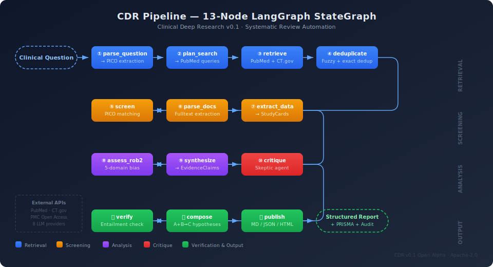

<div align="center">

# Clinical Deep Research (CDR)

**Automated evidence engine for clinical discovery & systematic review**

[](https://github.com/DeepRatAI/Clinical-Deep-Research_CDR/actions)
[](https://www.python.org/downloads/release/python-3120/)
[](LICENSE)
[](RELEASE_CRITERIA.md)



</div>

> **⚠️ NOT MEDICAL ADVICE.** CDR is a research exploration tool. It does not diagnose, prescribe, or replace professional medical judgment. See [DISCLAIMER.md](DISCLAIMER.md).

---

## What is CDR?

Given a **clinical research question**, CDR produces a **structured, evidence-traced research report** — from literature retrieval through risk-of-bias assessment to verified synthesis — in a single automated pipeline.

**Example:**

```
Input:  "What is the efficacy of GLP-1 receptor agonists vs placebo
         for HbA1c reduction in type 2 diabetes?"

Output: Structured report with PICO, PRISMA flow, study cards,
        RoB2 assessment, evidence claims with citations,
        GRADE certainty, and clinical disclaimer.
```

## What Makes CDR Different?

- **Full traceability**: Every claim links to specific snippets from specific studies. No unsupported assertions.
- **PRISMA-aligned workflow**: 13-node pipeline following systematic review methodology (search → screen → extract → synthesize → verify → publish).
- **Risk of Bias (RoB2)**: Automated per-study bias assessment across all five Cochrane domains.
- **Adversarial critique**: Built-in Skeptic agent challenges claims before publication.
- **Verification gates**: Citation coverage, entailment checking, and evidence-quality thresholds enforced before any report is published.
- **Multi-provider LLM**: Supports 8 LLM providers (Gemini, OpenAI, Anthropic, HuggingFace, Groq, Cerebras, OpenRouter, Cloudflare) — no vendor lock-in.

## Architecture

<div align="center">

</div>

The CDR pipeline is a **13-node LangGraph StateGraph** organized in four phases:

| Phase | Nodes | Purpose |
|-------|-------|---------|
| **Retrieval** | parse_question → plan_search → retrieve → deduplicate | PICO extraction, PubMed/CT.gov search, deduplication |
| **Screening** | screen → parse_docs → extract_data | Inclusion/exclusion, full-text parsing, study card extraction |
| **Analysis** | assess_rob2 → synthesize → critique | RoB2 bias assessment, evidence synthesis, adversarial critique |
| **Output** | verify → compose → publish | Entailment checking, hypothesis composition, report generation |

For deeper technical details, see [ARCHITECTURE.md](ARCHITECTURE.md), [CASE_STUDY.md](CASE_STUDY.md) and [docs/contracts/](docs/contracts/).

## Quick Start

### Option A: Make (recommended)

```bash
git clone https://github.com/DeepRatAI/Clinical-Deep-Research_CDR.git
cd Clinical-Deep-Research_CDR

# Setup environment + install dependencies
make setup

# Configure API keys
cp .env.example .env
# Edit .env — at minimum set one LLM provider key (e.g., HF_TOKEN)

# Run the test suite
make test

# Start the API server
make server
```

### Option B: Docker

```bash
git clone https://github.com/DeepRatAI/Clinical-Deep-Research_CDR.git
cd Clinical-Deep-Research_CDR
cp .env.example .env
# Edit .env with your API keys

docker-compose up -d
# API at http://localhost:8000  |  UI at http://localhost:5173
```

### Option C: Manual

```bash
python3.12 -m venv .venv
source .venv/bin/activate
pip install -e ".[dev]"
cp .env.example .env
# Edit .env with at least one LLM provider key

pytest tests/ -v               # Run tests
uvicorn cdr.api.routes:app \
  --host 0.0.0.0 --port 8000  # Start server
```

### Run a Query

```bash
curl -X POST http://localhost:8000/api/v1/runs \
  -H "Content-Type: application/json" \
  -d '{
    "question": "What is the efficacy of GLP-1 agonists vs placebo for HbA1c reduction in T2DM?",
    "provider": "gemini",
    "dod_level": 2
  }'
```

### Run Evaluation

```bash
make eval
# Results → eval/results/baseline_v0_1.json
```

## Demo & Sample Outputs

### Offline Demo (no API keys needed)

```bash
make demo
```

Validates the bundled [sample_report.json](examples/output/sample_report.json) against the [JSON Schema](schemas/report.schema.json) and renders a human-readable [sample_report.md](examples/output/sample_report.md).

### Online Demo (real pipeline, requires API keys)

```bash
# Configure at least one LLM provider key in .env
make demo-online
```

Runs 5 clinical questions through the full 13-node pipeline (PubMed retrieval → synthesis → verification → publication). Results are saved to `examples/output/online/run_01..05/`.

See [online run notes](docs/online_run_notes.md) for metadata on pre-computed runs.

### Evaluation Charts

```bash
make figures
```

Generates [latency charts](eval/results/fig_latency.png) from baseline evaluation data.

### Understanding a CDR Report

See [Report Anatomy](docs/report_anatomy.md) for a field-by-field guide on reading and auditing CDR output.

## Output Sample

CDR produces structured reports with fixed sections:

```json
{
  "run_id": "a1b2c3d4",
  "question": "...",
  "pico": {
    "population": "Adults with type 2 diabetes",
    "intervention": "GLP-1 receptor agonists",
    "comparator": "Placebo",
    "outcome": "HbA1c reduction"
  },
  "prisma_counts": { "records_identified": 150, "studies_included": 8 },
  "claims": [
    {
      "claim_text": "GLP-1 agonists reduce HbA1c by 1.0–1.5% vs placebo",
      "certainty": "high",
      "supporting_snippet_ids": ["snip_001", "snip_003"]
    }
  ],
  "rob2_summary": { "overall": "low_to_some_concerns" },
  "verification_summary": { "overall_status": "verified" },
  "disclaimer": "⚠️ This report is machine-generated. Not medical advice."
}
```

Full schema: [schemas/report.schema.json](schemas/report.schema.json)

## Project Structure

```
cdr/
├── src/cdr/              # Source code (18 subpackages)
│   ├── api/              # FastAPI endpoints (18 routes)
│   ├── core/             # Schemas, enums, exceptions
│   ├── orchestration/    # LangGraph workflow (13 nodes)
│   ├── retrieval/        # PubMed, CT.gov, BM25, dense, rerank
│   ├── rob2/             # Risk of Bias 2.0 assessment
│   ├── synthesis/        # Evidence claims + GRADE
│   ├── verification/     # Citation coverage + entailment
│   ├── publisher/        # MD / JSON / HTML report generation
│   ├── llm/              # Multi-provider LLM abstraction
│   └── observability/    # Structured tracing + metrics
├── tests/                # 635 backend + 81 frontend tests
├── eval/                 # Evaluation framework + baseline results
├── ui/                   # React 18 + TypeScript frontend
├── schemas/              # Output JSON schema (v0.1)
├── docs/contracts/       # Stage-level input/output contracts
├── examples/             # Usage examples with sample outputs
└── .github/              # CI workflows + issue templates
```

## Testing

```bash
make test        # Backend (635 tests)
make test-ui     # Frontend (81 tests)
make eval        # Evaluation baseline
make lint        # Ruff lint + format check
```

## Troubleshooting

| Problem | Solution |
|---------|----------|
| `ModuleNotFoundError: cdr` | Run `pip install -e .` or set `PYTHONPATH=src` |
| `openai.AuthenticationError` | Check `.env` has a valid key for your chosen provider |
| `Connection refused :8000` | Server not running — run `make server` |
| `weasyprint` install fails | `apt-get install libpango-1.0-0 libharfbuzz0b libffi-dev` |
| Tests fail with network errors | Tests are fully mocked — check `no_proxy` isn't interfering |
| Docker healthcheck fails | Wait 30s for startup; run `docker logs cdr-api-1` |

## Documentation

| Document | Description |
|----------|-------------|
| [ARCHITECTURE.md](ARCHITECTURE.md) | Pipeline design, data model, stage contracts |
| [CASE_STUDY.md](CASE_STUDY.md) | Technical narrative: decisions, tradeoffs, hard problems |
| [EVAL.md](EVAL.md) | Evaluation methodology + baseline results |
| [docs/report_anatomy.md](docs/report_anatomy.md) | How to read and audit a CDR report |
| [docs/online_run_notes.md](docs/online_run_notes.md) | Metadata for pre-computed online runs |
| [DISCLAIMER.md](DISCLAIMER.md) | Clinical disclaimer and responsible use |
| [CONTRIBUTING.md](CONTRIBUTING.md) | How to contribute: setup, tests, PR guidelines |
| [ROADMAP.md](ROADMAP.md) | v0.1 → v0.2 → v1.0 milestones |
| [SECURITY.md](SECURITY.md) | Vulnerability reporting + security practices |
| [CHANGELOG.md](CHANGELOG.md) | Version history |
| [RELEASE_CRITERIA.md](RELEASE_CRITERIA.md) | Definition of Done for v0.1 |
| [INCIDENTS.md](INCIDENTS.md) | Postmortems: real problems encountered |
| [docs/contracts/](docs/contracts/) | Stage-level I/O contracts |

## License

[Apache 2.0](LICENSE) — Copyright 2025–2026 DeepRatAI

---

> ⚠️ **CDR is NOT a medical device.** It does not provide medical advice, diagnose conditions, or recommend treatments. All outputs require expert review. See [DISCLAIMER.md](DISCLAIMER.md).
